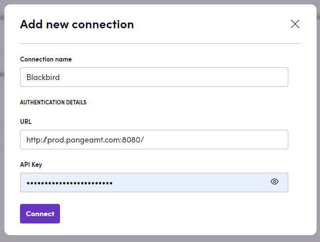

# Blackbird.io Pangeanic

Blackbird is the new automation backbone for the language technology industry. Blackbird provides enterprise-scale automation and orchestration with a simple no-code/low-code platform. Blackbird enables ambitious organizations to identify, vet and automate as many processes as possible. Not just localization workflows, but any business and IT process. This repository represents an application that is deployable on Blackbird and usable inside the workflow editor.

## Introduction

<!-- begin docs -->

Pangeanic produces custom AI models so you can create your own Generative AI (GenAI) with no data transfer to third parties.

## Before setting up

Before you can connect you need to make sure that:

- You must have API key for Pangeanic services

- If you don't have an API key, you can contact [Pangeanic](https://pangeanic.com/translation-technology/translate-easy).

## Connecting 

1. Navigate to apps and search for Contentstack. If you cannot find Contentstack, then click _Add App_ in the top right corner, select Contentstack, and add the app to your Blackbird environment.
2. Click _Add Connection_.
3. Name your connection for future reference, e.g., 'My client'.
4. In the _API Key_ field, input your API Key.
5. In the _URL_ field, input URL of your api. For example: http://prod.pangeamt.com:8080/
5. Click _Connect_.
6. Confirm that the connection has appeared and the status is _Connected_.

## Actions

### Text

- **Process text**: Sends text to the API for processing and translation. It then retrieves the response containing the translations

### File

- **Process file**: Sends file to the API for processing and translation, and then retrieves the response containing the File ID

- **Download file**: Download translated file based on file ID

## Events

- **On file translation status updated**: Check for updates on file translations. By default, it checks for finished translations. You can specify the status to check for

## Feedback

Do you want to use this app or do you have feedback on our implementation? Reach out to us using the [established channels](https://www.blackbird.io/) or create an issue.

<!-- end docs -->
